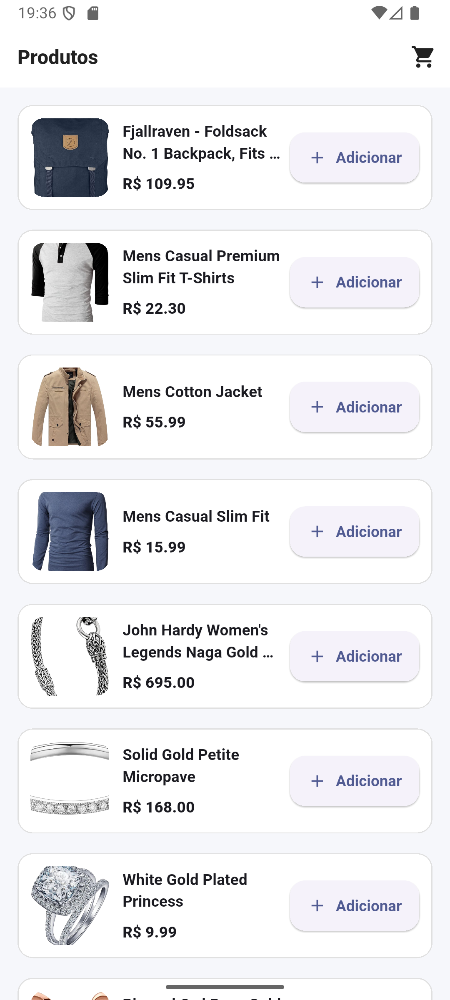
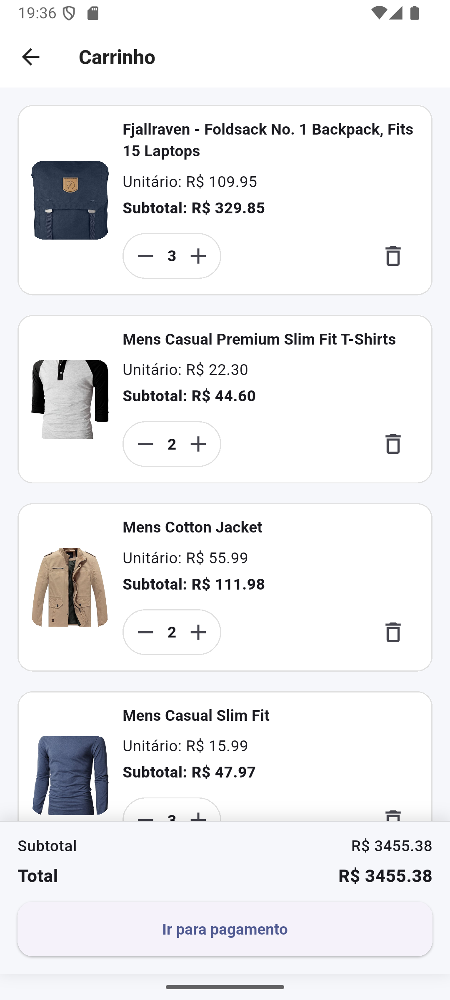
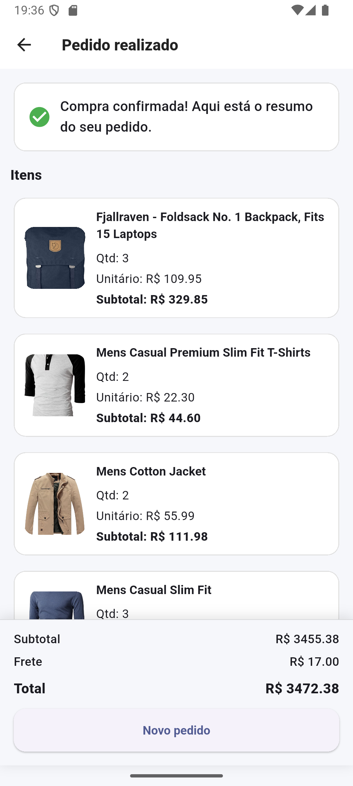

# Flutter Shopping Cart (MVVM + ChangeNotifier)

Aplicativo de carrinho de compras desenvolvido em Flutter seguindo MVVM com `ChangeNotifier`.
Consome a FakeStore API e simula serviços (remoção com erro e checkout com delay).

## ✅ Funcionalidades
- Catálogo de produtos (FakeStore API)
- Carrinho global (estado em memória)
- Limite de 10 produtos diferentes no carrinho
- Controle de quantidade (+/−)
- Remover item com erro simulado via serviço
- Resumo do pedido (checkout) com subtotal + frete simulado + total
- Confirmação de pagamento (serviço simulado com delay e chance de falha)
- Tela de pedido finalizado com itens + subtotal + frete + total
- “Novo pedido” limpa o carrinho e volta ao catálogo

## 🧱 Arquitetura (MVVM)
- **View (UI)**: telas e widgets
- **ViewModel/Store (`ChangeNotifier`)**: estado (loading/erro/dados) + ações
- **Data (APIs/DTO/Mappers)**: integração HTTP e serviços simulados
- **Domain (Entities)**: regras e entidades (`Cart`, `CartItem`, `Product`)
- **Core**: `Result` + `AppException` para padronizar retorno/erros
- **Design System**: tema e widgets reutilizáveis (cards/linhas/itens)

## 📌 Regras importantes
- Carrinho permite no máximo **10 produtos diferentes** (IDs distintos).
- Quantidade total pode ser maior que 10 (ex.: 1 produto com quantidade 11).

Fluxo:
UI -> ViewModel/Store -> Services/APIs
              |
            Domain

## 🧭 Fluxo de telas
1. **Produtos** (`/`)
2. **Carrinho** (`/cart`)
3. **Resumo do pedido / Checkout** (`/checkout`)
4. **Pedido finalizado** (`/success`)
   - exibe itens + subtotal + frete + total
   - “Novo pedido” limpa carrinho e volta para `/`

## 🗺️ Rotas
- `/` (Catálogo)
- `/cart` (Carrinho)
- `/checkout` (Resumo/Checkout)
- `/success` (Pedido finalizado)

## 🔗 API
- Produtos: `https://fakestoreapi.com/products`

## 🧰 Stack
- Flutter 3.32.8
- Dart SDK: ^3.8.1
- provider: ^6.1.5+1
- http: ^1.6.0

## 🖼️ Screenshots

- **Catálogo (Produtos)**  
  

- **Carrinho**  
  

- **Resumo do pedido (Checkout)**  
  

- **Pedido realizado**  
  

## 🚀 Como rodar
```bash
flutter pub get
flutter run
